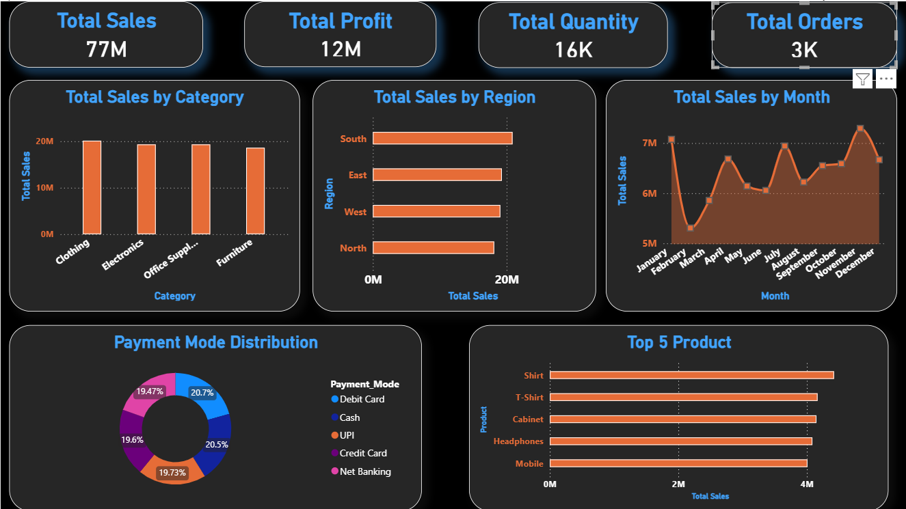

# Sales Performance Dashboard

## Project Overview
This project is a Sales Performance Dashboard developed using Power BI to analyze sales data and provide actionable business insights. The dashboard helps track sales performance, monitor key metrics, identify top-performing products, and support data-driven decision-making.

## Objectives
- Analyze overall sales performance.
- Monitor revenue, profit, and quantity sold.
- Identify top-performing products and categories.
- Analyze sales trends over time.
- Compare performance across different regions.

## Tools Used
- Power BI
- Microsoft Excel
- DAX
- Data Visualization

## Dataset Information
The dataset contains sales transaction records including:
- Order Date
- Product Name
- Category
- Region
- Sales
- Profit
- Quantity
- Payment Mode

## Dashboard Features
- KPI Cards for Total Sales, Profit, Quantity, and Orders
- Monthly Sales Trend Analysis
- Sales by Region
- Sales by Category
- Top 10 Products by Sales

## Key Insights
- Identified the highest-performing products.
- Analyzed regional sales performance.
- Tracked monthly sales growth trends.
- Evaluated category-wise profitability.

## Challenges Faced
- Data Cleaning and Preparation
- Creating DAX Measures
- Designing Interactive Visualizations

## Dashboard Preview

## Files Included
- DA Project.pbix
- Sales_Performance_Dashboard_Dataset.xlsx
- Sales Performance Dashboard Report.docx
- Dashboard Screenshot.png

## Conclusion
The Sales Performance Dashboard provides a comprehensive view of sales performance through interactive visualizations. It enables businesses to monitor trends, identify opportunities, and make informed decisions based on data.

## Author
Darshan Shivgan
